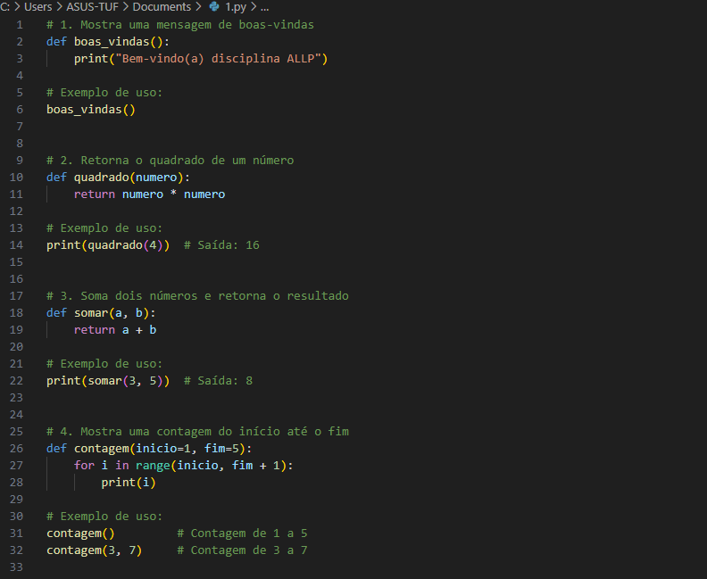
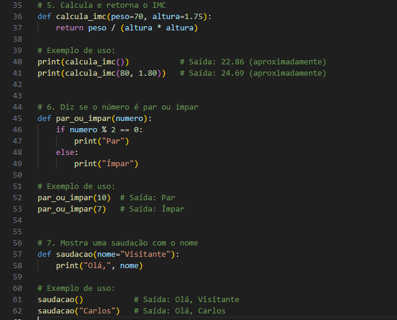

# 🚀 Funções Simples em Python

Este repositório contém um conjunto de funções básicas em Python, criadas para fins didáticos e de prática de programação.

## 📝 O que o código faz

- 👋 Exibe uma mensagem de boas-vindas.
- 🔢 Calcula o quadrado de um número.
- ➕ Soma dois números.
- 🔢 Imprime uma contagem de um número inicial até um final (com valores padrão).
- ⚖️ Calcula o Índice de Massa Corporal (IMC) com peso e altura fornecidos.
- 🔍 Verifica se um número é par ou ímpar.
- 🙋 Exibe uma saudação personalizada, com nome opcional.

Cada função é simples, fácil de entender e vem acompanhada de exemplos de uso para facilitar o aprendizado.

## 📚 Exemplos de uso

### 📌 Exemplos 1 a 4

Aqui estão os exemplos para as funções de número 1 a 4, mostrando mensagens e resultados básicos:

### 📌 Exemplos 5 a 7

Aqui estão os exemplos para as funções de número 5 a 7, incluindo cálculo de IMC, verificação de paridade e saudação:

## ⚙️ Como usar

Basta copiar as funções para seu código Python e chamar conforme os exemplos mostrados.

---

✨ Feito para quem está começando a aprender funções em Python!
